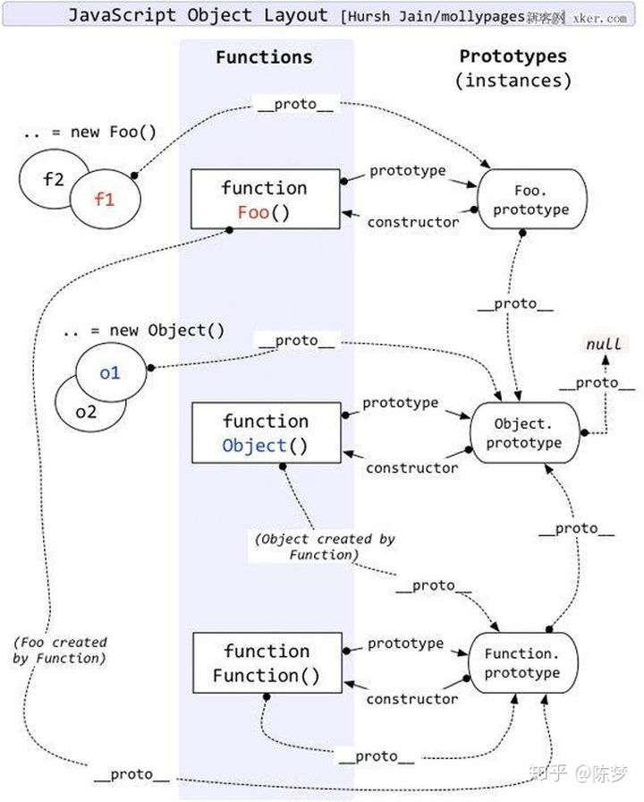

## 原型
每一个JavaScript对象(null除外)在创建的时候就会与之关联另一个对象，这个对象就是我们所说的原型，每一个对象都会从原型"继承"属性。
```
function b() {}
b.prototype == {
  constructor: b,
  __proto__: {Object}
}
b.__proto__ === Function.prototype; // true

var b1 = new b();
b.__proto__ = b.prototype; //true

```


### 原型链


JavaScript的对象之间通过原型联系，在联系的对象之间，通过原型链接起来形成了一条链，叫做原型链。原型链最大的作用是用于实现继承。
