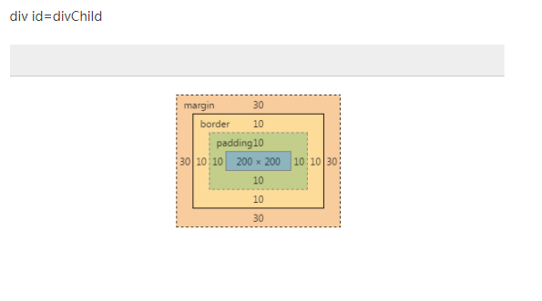
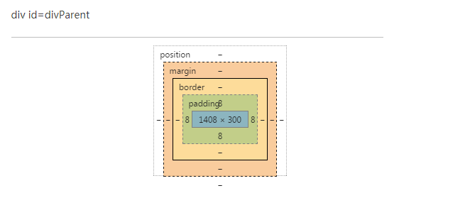

### 1.css清除浮动 http://www.cnblogs.com/iyangyuan/archive/2013/03/27/2983813.html; 
或 http://snailsky.me/2014/08/20/%E6%B5%AE%E5%8A%A8%E5%92%8C%E5%AE%83%E7%9A%84%E5%B7%A5%E4%BD%9C%E5%8E%9F%E7%90%86%EF%BC%9F%E6%B8%85%E9%99%A4%E6%B5%AE%E5%8A%A8%E7%9A%84%E6%8A%80%E5%B7%A7%EF%BC%9F/
### 2.[vertical-align详解](http://www.cnblogs.com/hykun/p/3937852.html)  

### 3.HTML常用的宽高等属性 
```
<div id="divParent" style="padding: 8px; background-color:#CCC; position: relative;">  
        <div id="divChild" style="background-color:#C00; margin: 30px; padding: 10px;  
            height: 200px; width: 200px; border: solid 10px  #0000CC;">  
        </div>  
    </div>  
```
1. offset:  
1.1 offsetLeft:div.margin.left + parent.padding.left = 30 + 8 =38.  
1.2 offsetTop同理。  
1.3 offsetWidth: div.content.width + div.border.(left/right) + div.padding.(left/right) = 200 + 10 + 10 + 10 + 10 = 240.  
1.4 offsetHeight同理。  

2. client:这个是div自己的事了  
2.1 clientLeft: div.padding.left外边缘到div.border.left外边缘距离 = border.left = 10.  
2.2 clientTop同理。  
2.3 clientWidth: div.content + div.padding = 200 +10 +10 = 220.  
2.4 clientHeight同理。  
  

---
```
<div id="divParent"  style="padding: 8px; background-color: #aaa; height:200px; width:300px; overflow:auto;position:reative" >  
       <div id="divChild" style="background-color: #0f0;height: 400px; width: 500px; border: solid 10px #f00;positon:abosulte">  
       </div>  
   </div>  
```
3. scroll:  
3.1 scrollWidth:元素内无内容或者内容不超过可视区，滚动不出现或不可用的情况下。scrollWidth=clientWidth，两者皆为内容可视区的宽度。
    溢出或有滚动条 divparent.scrollwidth = div.width + div.border.(left/right) + div.padding(left/right) + parent.padding =
    500 + 10*2 + 0 + 8= 528.  
3.2 scrollHeigth同理。  
3.3 scrollLeft:拖动进去的宽度。  
3.4 scrollTop同理。
4. left: left = div.margin.left外边缘到parent.border.left内边缘的距离(不计算border宽度);top同理。  
### 4.document.body.scrolltop一直都是0  
> 页面具有 DTD（或者说指定了 DOCTYPE）时，使用 document.documentElement。
  页面不具有 DTD（或者说没有指定了 DOCTYPE）时，使用 document.body。
  但是我感觉好像没有起作用，终极无敌解决兼容方案:  
  将`document.documentElement.scrollTop`替换`document.body.scrollTop`。
 
### 5.每天一种布局：
1,左右两边固定宽度，中间自适应。
https://codepen.io/xiexielala/pen/MGVKze
### 6.上下居中
[codepen演示](https://codepen.io/xiexielala/pen/yENEmE)
```
   .box{
     display:inline-block;
     margin: 5px;
     width: 300px;
     height:300px;
     background:#3190e8;
     position:relative;
   }
   .child{
     background:red;
   }
   ```
1.知道子元素高度，用绝对定位和margin
```
<div class="box">
     <div class="child" id ="one"></div>
   </div>
#one{
  width:150px;
  height:100px;
  position:absolute;
  top:50%;
  margin-top:-50px;
}
```
2.绝对定位加transform，不用知道元素高度
```
<div class="box">
     <div class="child" id ="two"></div>
   </div>
#two{
    width:150px;
     height:100px;
     position:absolute;
     top:50%;
     transform: translate(0,-50%);
   }

```
3.使用absolute 加margin，跟第一种是一样的，只是变成了百分比
```
<div class="box">
  <div class="child" id ="three"></div>
</div>
#three{
   width:50%;
  height:30%;
  position:absolute;
  top:50%;
  margin-top:-15%
}
```
4.绝对定位结合margin: auto
```
<div class="box">
  <div class="child" id ="four"></div>
</div>
#four{
  width:150px;
  height:100px;
  position:absolute;
  top:0;
  bottom:0;
  margin:auto;
}
```
5.父元素使用padding,这是父元素是不设高度的，高度是子元素撑出来的
```
<div class="box fivebox">
  <div class="child" id ="five"></div>
</div>
.fivebox{
  height:auto;
  padding:100px 0;
}
#five{
  width:150px;
  height:100px;
}
```
6.vertical-align:middle,加一个空白span，高度100%
```
<div class="box">
  <div class="child" id ="six"></div>
  <span style="height:100%;width:1px; vertical-align:middle;display:inline-block;"></span>
</div>
#six{
    width: 150px;
    height: 100px;
    vertical-align: middle;
    display: inline-block;
}

```
7.vertical-align:middle，line-height = height
```
<div class="box sevenbox">
  <div class="child" id ="seven"></div>
</div>
.sevenbox{
  line-height:300px;

}
#seven{
  width: 150px;
    height: 100px;
  display:inline-block;
  vertical-align:middle;
}


```
8. display:table-cell
```angular2html
<div class="box eightbox">
  <div class="child" id ="eight"></div>
</div>
.eightbox{
  display: table-cell;
    vertical-align: middle;
}
#eight{
  width:150px;
  height:100px;
  
}

```
9.display:flex;align-items: center;
```angular2html
<div class="box ninebox">
  <div class="child" id ="nine"></div>
</div>
.ninebox{
  display:flex;
  align-items: center;
}
#nine{
   width:150px;
  height:100px;
}
```
10.display：flex，改变主轴方向，    flex-direction: column; 在居中
justify-content: center;
````
<div class="box tenbox">
  <div class="child" id ="ten"></div>
</div>

.tenbox{
  display:flex;
      flex-direction: column;
    justify-content: center;
}
#ten{
   width:150px;
  height:100px;
}
````
### 7.[BFC详解](https://www.jianshu.com/p/fc1d61dace7b)  
### 8.[CSS盒模型](https://juejin.im/post/59ef72f5f265da4320026f76)
分为ie盒模型和w3c标准盒模型。
在ie8+浏览器中使用哪个盒模型可以由box-sizing(CSS新增的属性)控制，
默认值为content-box，即标准盒模型；如果将box-sizing设为border-box
则用的是IE盒模型。如果在ie6,7,8中DOCTYPE缺失会触发IE模式。在当前W3C
标准中盒模型是可以通过box-sizing自由的进行切换的。

1. ie盒模型： 属性width,height包含border和padding，
指的是content+padding+border。就是说你设定了width，height，你怎么改变
padding 和border,盒子大小都不会变的。
2. w3c标准盒模型：width和height只是设置了content的宽高，盒子高度可由padding
+ border大小改变。

### 9. link跟@import的区别
(1) 定义rel连接属性等作用；而@import是CSS提供的，只能用于加载CSS; 
(2)页面被加载的时，link会同时被加载，而@import引用的CSS会等到页面被加载完再加载; 
（3）import是CSS2.1 提出的，只在IE5以上才能被识别，而link
是XHTML标签，无兼容问题。

http://www.daqianduan.com/2417.html

### 10. [重绘跟回流](http://www.css88.com/archives/4996)
这里有个有趣的东西，就是`DocumentFragment`,用于优化dom操作，
比如我们渲染列表的时候，经常用一个字符串先组装dom，然后在`appendChild`
到dom中，`DocumentFragment`也可以解决这个，减少dom的回流重绘。

https://juejin.im/post/590f4eadac502e006cf718c3

### 11 css3动画
https://codepen.io/xiexielala/pen/ajoeVz?editors=1111
1. transition:过渡效果，有一下的属性：
+ transition-property：过渡属性，不指定的属性仍然是瞬间变化
+ transition-duration：过渡时长，比如width 1s变化。
+ transition-timing-function：过渡效果，默认是ease逐渐变慢，linear：匀速，ease-in：加速
ease-out：减速cubic-bezier函数：自定义速度模式（http://cubic-bezier.com/#.86,.17,.08,.82）
+ transition-delay:延时， transition: 1s height, 1s 2s width;表示2s后width
才开始变化，用于组合多种变化效果
> 优缺点：
 + 优点就是很简单
 + transition需要事件触发，所以没法在网页加载时自动发生。
 + transition是一次性的，不能重复发生，除非一再触发。
 + transition只能定义开始状态和结束状态，不能定义中间状态，也就是说只有两个状态。
 + transition需要明确知道，开始状态和结束状态的具体数值，才能计算出中间状态。比如，height从0px变化到100px，transition可以算出中间状态。但是，transition没法算出0px到auto的中间状态，也就是说，如果开始或结束的设置是height: auto，那么就不会产生动画效果。类似的情况还有，
 display: none到block，background: url(foo.jpg)到url(bar.jpg)等等。

2.Animation
https://codepen.io/xiexielala/pen/gjOPOL
+ animation-name: 动画名字，用`@keyframes`定义
+ animation-duration：动画时间，秒或毫秒
+ animation-timing-function：规定动画的速度曲线，ease-in-out	动画以低速开始和结束，跟
transition一样
+ animation-delay：延时执行，秒或毫秒
+ animation-iteration-count：动画执行次数，使用数字或者infinite表示无限次
+ animation-direction：定义是否应该轮流反向播放动画，normal默认值，表示正常播放，
alternate表示轮流反向播放。
+ animation-play-state：规定动画正在运行running还是暂停paused
+  animation-fill-mode：动画在播放之前或之后，其动画效果是否可见，forwards：显示最后一个属性
backwards：在 animation-delay 所指定的一段时间内，在动画显示之前，
应用开始属性值（在第一个关键帧中定义），both都是
                                            
### 13.css优先级计算
1. 引入样式的优先级
+ 内联样式 > 外部样式|内部样式
+ 外部样式和内部样式，最后出现优先级高。

2. 声明样式计算算法

等级 |标签选择符|ID选择符|Class选择符/属性选择符/伪类选择符|元素选择符
|:-----|:-------:|:-----|:-----|:--------|
|示例      |`<span style="color:red;">`|`#text{color:red;}`  | `	.text{color:red;} [type="text"]{color:red}` |`span{color:red;}`
|标记位    |`x,0,0,0`      |`0,x,0,0`  |`0,0,x,0` |`	0,0,0,x`

+ **每个等级的初始值为0**
+ **每个等级的叠加为选择器出现的次数相加**
+ **不可进位，比如0,99,99,99**
+ **依次表示为：0,0,0,0**
+  **每个等级计数之间没关联**
+ **等级判断从左向右，如果某一位数值相同，则判断下一位数值**
+  **如果两个优先级相同，则最后出现的优先级高，!important也适用**
+ **通配符选择器的特殊性值为：0,0,0,0**
+  **继承样式优先级最低，通配符样式优先级高于继承样式**
 
###计算实例
```
a{color: yellow;} /*特殊性值：0,0,0,1*/
div a{color: green;} /*特殊性值：0,0,0,2 相同等级的叠加计算了*/
.demo a{color: black;} /*特殊性值：0,0,1,1*/
.demo input[type="text"]{color: blue;} /*特殊性值：0,0,2,1*/
.demo *[type="text"]{color: grey;} /*特殊性值：0,0,2,0*/
#demo a{color: orange;} /*特殊性值：0,1,0,1*/
div#demo a{color: red;} /*特殊性值：0,1,0,2 不同等级的是不影响的*/

```