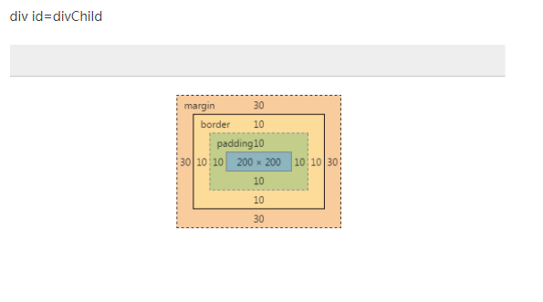
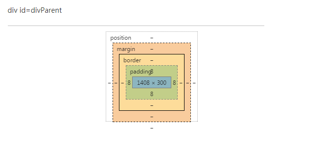

### 1.css清除浮动 http://www.cnblogs.com/iyangyuan/archive/2013/03/27/2983813.html; 
或 http://snailsky.me/2014/08/20/%E6%B5%AE%E5%8A%A8%E5%92%8C%E5%AE%83%E7%9A%84%E5%B7%A5%E4%BD%9C%E5%8E%9F%E7%90%86%EF%BC%9F%E6%B8%85%E9%99%A4%E6%B5%AE%E5%8A%A8%E7%9A%84%E6%8A%80%E5%B7%A7%EF%BC%9F/
### 2.[vertical-align详解](http://www.cnblogs.com/hykun/p/3937852.html)  

### 3.HTML常用的宽高等属性 
```
<div id="divParent" style="padding: 8px; background-color:#CCC; position: relative;">  
        <div id="divChild" style="background-color:#C00; margin: 30px; padding: 10px;  
            height: 200px; width: 200px; border: solid 10px  #0000CC;">  
        </div>  
    </div>  
```
1. offset:  
1.1 offsetLeft:div.margin.left + parent.padding.left = 30 + 8 =38.  
1.2 offsetTop同理。  
1.3 offsetWidth: div.content.width + div.border.(left/right) + div.padding.(left/right) = 200 + 10 + 10 + 10 + 10 = 240.  
1.4 offsetHeight同理。  

2. client:这个是div自己的事了  
2.1 clientLeft: div.padding.left外边缘到div.border.left外边缘距离 = border.left = 10.  
2.2 clientTop同理。  
2.3 clientWidth: div.content + div.padding = 200 +10 +10 = 220.  
2.4 clientHeight同理。  
  

---
```
<div id="divParent"  style="padding: 8px; background-color: #aaa; height:200px; width:300px; overflow:auto" >  
       <div id="divChild" style="background-color: #0f0;height: 400px; width: 500px; border: solid 10px #f00;">  
       </div>  
   </div>  
```
3. scroll:  
3.1 scrollWidth:元素内无内容或者内容不超过可视区，滚动不出现或不可用的情况下。scrollWidth=clientWidth，两者皆为内容可视区的宽度。
    溢出或有滚动条 divparent.scrollwidth = div.width + div.border.(left/right) + div.padding(left/right) + parent.padding =
    500 + 10*2 + 0 + 8= 528.  
3.2 scrollHeigth同理。  
3.3 scrollLeft:拖动进去的宽度。  
3.4 scrollTop同理。
