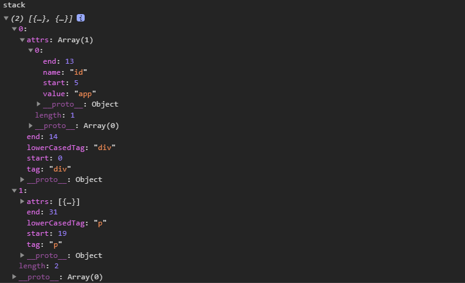
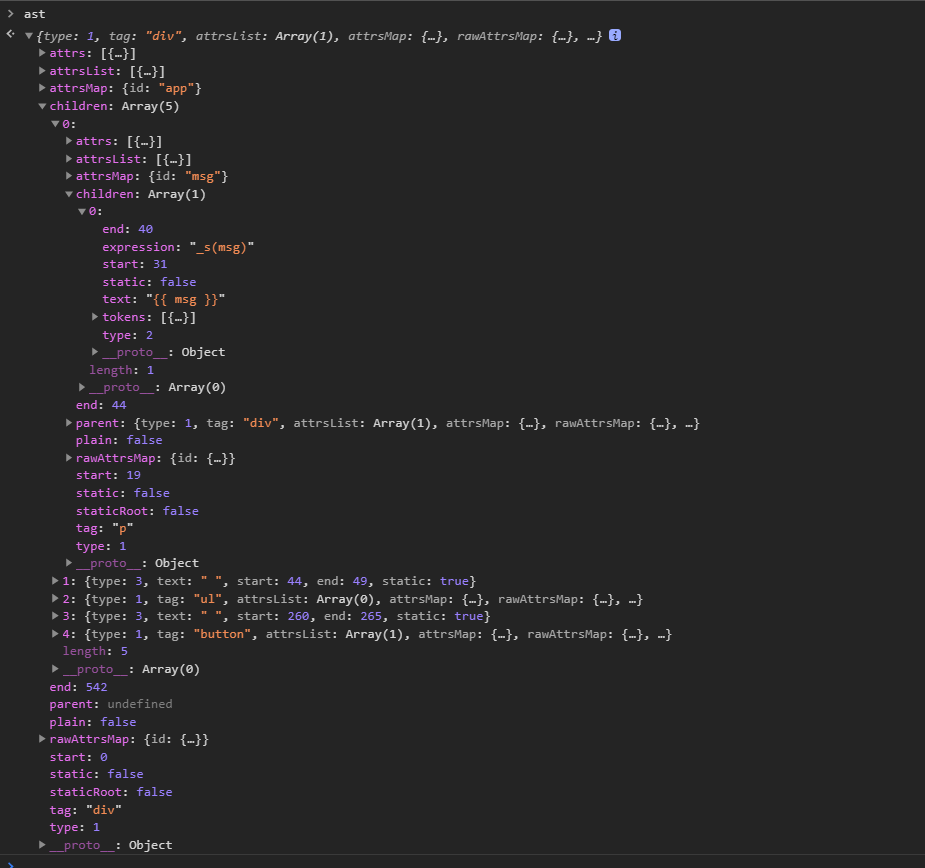

# 解析html
主要是通过正则匹配，匹配起始标签，结束标签，中间的标签等，代码在`src/compiler/parser/html-parser.js`
```
  function parseHTML (html, options) {
  const stack = []
  const expectHTML = options.expectHTML
  const isUnaryTag = options.isUnaryTag || no
  const canBeLeftOpenTag = options.canBeLeftOpenTag || no
  let index = 0
  let last, lastTag
  while (html) {
    last = html
    // Make sure we're not in a plaintext content element like script/style
    if (!lastTag || !isPlainTextElement(lastTag)) {
      let textEnd = html.indexOf('<')
      if (textEnd === 0) {
        // Comment:
        if (comment.test(html)) {
          const commentEnd = html.indexOf('-->')

          if (commentEnd >= 0) {
            if (options.shouldKeepComment) {
              options.comment(html.substring(4, commentEnd), index, index + commentEnd + 3)
            }
            advance(commentEnd + 3)
            continue
          }
        }

        // http://en.wikipedia.org/wiki/Conditional_comment#Downlevel-revealed_conditional_comment
        if (conditionalComment.test(html)) {
          const conditionalEnd = html.indexOf(']>')

          if (conditionalEnd >= 0) {
            advance(conditionalEnd + 2)
            continue
          }
        }

        // Doctype:
        const doctypeMatch = html.match(doctype)
        if (doctypeMatch) {
          advance(doctypeMatch[0].length)
          continue
        }

        // End tag:
        const endTagMatch = html.match(endTag)
        if (endTagMatch) {
          const curIndex = index
          advance(endTagMatch[0].length)
          parseEndTag(endTagMatch[1], curIndex, index)
          continue
        }

        // Start tag:
        const startTagMatch = parseStartTag()
        if (startTagMatch) {
          handleStartTag(startTagMatch)
          if (shouldIgnoreFirstNewline(startTagMatch.tagName, html)) {
            advance(1)
          }
          continue
        }
      }
      ....
      ....
```
经过一轮正则比较后，提取出每个标签的及其相关属性
  

生成的ast
  

下一步是优化ast,代码在`/src/compiler/index.js`
```
export const createCompiler = createCompilerCreator(function baseCompile (
  template: string,
  options: CompilerOptions
): CompiledResult {
  const ast = parse(template.trim(), options)
  if (options.optimize !== false) {
    optimize(ast, options)
  }
  const code = generate(ast, options)
  return {
    ast,
    render: code.render,
    staticRenderFns: code.staticRenderFns
  }
})
```
`optimize(ast)`的作用是优化ast，标记静态和非静态节点
+ 静态节点：数据变化时不用去重新对比，像注释节点，没有绑定data的节点
```
/**
 * Goal of the optimizer: walk the generated template AST tree
 * and detect sub-trees that are purely static, i.e. parts of
 * the DOM that never needs to change.
 *
 * Once we detect these sub-trees, we can:
 *
 * 1. Hoist them into constants, so that we no longer need to
 *    create fresh nodes for them on each re-render;
 * 2. Completely skip them in the patching process.
 */
export function optimize (root: ?ASTElement, options: CompilerOptions) {
  if (!root) return
  isStaticKey = genStaticKeysCached(options.staticKeys || '')
  isPlatformReservedTag = options.isReservedTag || no
  // first pass: mark all non-static nodes.
  markStatic(root)
  // second pass: mark static roots.
  markStaticRoots(root, false)
}

function isStatic (node: ASTNode): boolean {
  if (node.type === 2) { // expression
    return false
  }
  if (node.type === 3) { // text
    return true
  }
  return !!(node.pre || (
    !node.hasBindings && // no dynamic bindings
    !node.if && !node.for && // not v-if or v-for or v-else
    !isBuiltInTag(node.tag) && // not a built-in
    isPlatformReservedTag(node.tag) && // not a component
    !isDirectChildOfTemplateFor(node) &&
    Object.keys(node).every(isStaticKey)
  ))
}
```
优化ast之后，下一步就是用ast来生成`render function`,
```
const code = generate(ast, options)
```
取出ast里面的属性，拼接字符串,
```
export function generate (
  ast: ASTElement | void,
  options: CompilerOptions
): CodegenResult {
  const state = new CodegenState(options)
  const code = ast ? genElement(ast, state) : '_c("div")'
  return {
    render: `with(this){return ${code}}`,
    staticRenderFns: state.staticRenderFns
  }
}

export function genElement (el: ASTElement, state: CodegenState): string {
  if (el.parent) {
    el.pre = el.pre || el.parent.pre
  }

  if (el.staticRoot && !el.staticProcessed) {
    return genStatic(el, state)
  } else if (el.once && !el.onceProcessed) {
    return genOnce(el, state)
  } else if (el.for && !el.forProcessed) {
    return genFor(el, state)
  } else if (el.if && !el.ifProcessed) {
    return genIf(el, state)
  } else if (el.tag === 'template' && !el.slotTarget && !state.pre) {
    return genChildren(el, state) || 'void 0'
  } else if (el.tag === 'slot') {
    return genSlot(el, state)
  } else {
    // component or element
    let code
    if (el.component) {
      code = genComponent(el.component, el, state)
    } else {
      let data
      if (!el.plain || (el.pre && state.maybeComponent(el))) {
        data = genData(el, state)
      }

      const children = el.inlineTemplate ? null : genChildren(el, state, true)
      code = `_c('${el.tag}'${
        data ? `,${data}` : '' // data
      }${
        children ? `,${children}` : '' // children
      })`
    }
    // module transforms
    for (let i = 0; i < state.transforms.length; i++) {
      code = state.transforms[i](el, code)
    }
    return code
  }
}

```
比如`genData`
```
export function genData (el: ASTElement, state: CodegenState): string {
  let data = '{'

  // directives first.
  // directives may mutate the el's other properties before they are generated.
  const dirs = genDirectives(el, state)
  if (dirs) data += dirs + ','

  // key
  if (el.key) {
    data += `key:${el.key},`
  }
  // ref
  if (el.ref) {
    data += `ref:${el.ref},`
  }
  if (el.refInFor) {
    data += `refInFor:true,`
  }
  // pre
  if (el.pre) {
    data += `pre:true,`
  }
  // record original tag name for components using "is" attribute
  if (el.component) {
    data += `tag:"${el.tag}",`
  }
  // module data generation functions
  for (let i = 0; i < state.dataGenFns.length; i++) {
    data += state.dataGenFns[i](el)
  }
  // attributes
  if (el.attrs) {
    data += `attrs:${genProps(el.attrs)},`
  }
  // DOM props
  if (el.props) {
    data += `domProps:${genProps(el.props)},`
  }
  // event handlers
  if (el.events) {
    data += `${genHandlers(el.events, false)},`
  }
  if (el.nativeEvents) {
    data += `${genHandlers(el.nativeEvents, true)},`
  }
  // slot target
  // only for non-scoped slots
  if (el.slotTarget && !el.slotScope) {
    data += `slot:${el.slotTarget},`
  }
  // scoped slots
  if (el.scopedSlots) {
    data += `${genScopedSlots(el, el.scopedSlots, state)},`
  }
  // component v-model
  if (el.model) {
    data += `model:{value:${
      el.model.value
    },callback:${
      el.model.callback
    },expression:${
      el.model.expression
    }},`
  }
  // inline-template
  if (el.inlineTemplate) {
    const inlineTemplate = genInlineTemplate(el, state)
    if (inlineTemplate) {
      data += `${inlineTemplate},`
    }
  }
  data = data.replace(/,$/, '') + '}'
  // v-bind dynamic argument wrap
  // v-bind with dynamic arguments must be applied using the same v-bind object
  // merge helper so that class/style/mustUseProp attrs are handled correctly.
  if (el.dynamicAttrs) {
    data = `_b(${data},"${el.tag}",${genProps(el.dynamicAttrs)})`
  }
  // v-bind data wrap
  if (el.wrapData) {
    data = el.wrapData(data)
  }
  // v-on data wrap
  if (el.wrapListeners) {
    data = el.wrapListeners(data)
  }
  return data
}
```
生成的结果
```
"{attrs:{"id":"app"}}"
"{on:{"click":changeTxt2}}"
```

最后生成的`render function`
```
{
  "render": "with(this){return _c('div',{attrs:{\"id\":\"app\"}},[_c('p',{attrs:{\"id\":\"msg\"}},[_v(_s(msg))]),_v(\" \"),_c('ul',_l((ul),function(item,index){return _c('li',{key:item.key},[_v(_s(item.txt)+\"#\"+_s(item.key))])}),0),_v(\" \"),_c('button',{on:{\"click\":changeTxt2}},[_v(\"insert li \")])])}",
  "staticRenderFns": []
}
```