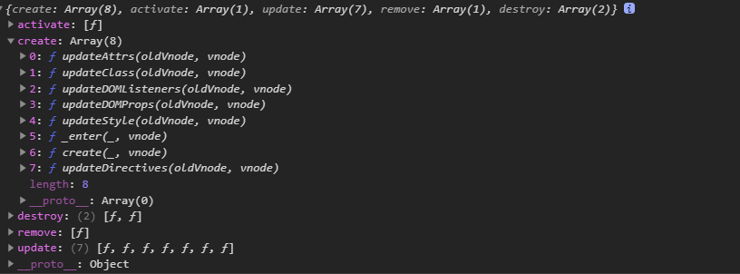
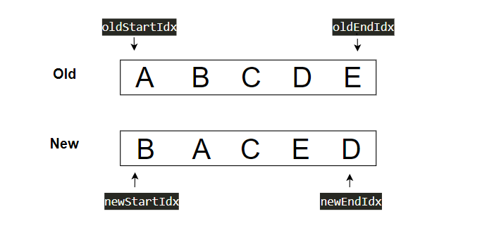
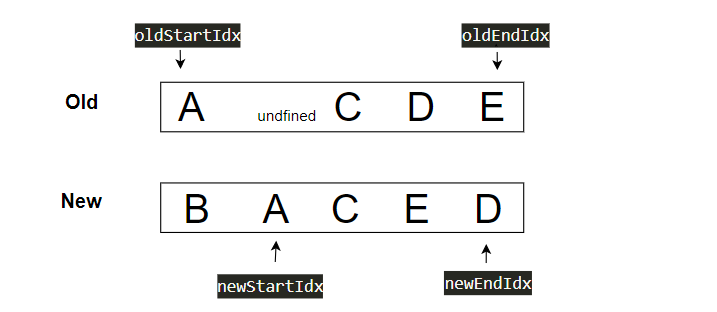
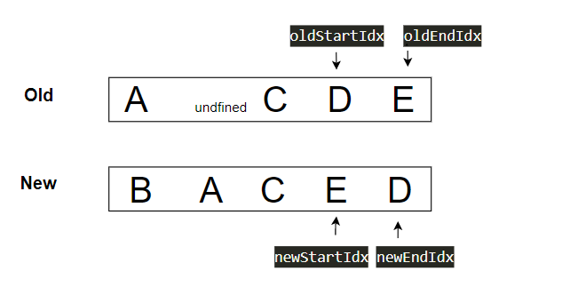
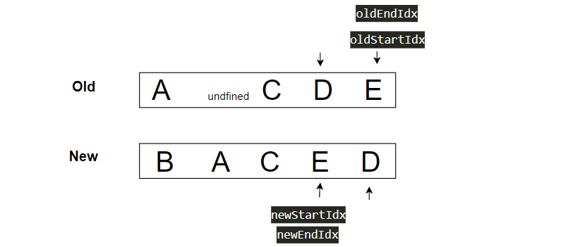

# 虚拟的dom的patch及生成真实dom
```
 patch (oldVnode, vnode, hydrating, removeOnly) {
    if (isUndef(vnode)) {
      if (isDef(oldVnode)) invokeDestroyHook(oldVnode)
      return
    }

    let isInitialPatch = false
    const insertedVnodeQueue = []

    if (isUndef(oldVnode)) {
      // empty mount (likely as component), create new root element
      isInitialPatch = true
      createElm(vnode, insertedVnodeQueue)
    } else {
      const isRealElement = isDef(oldVnode.nodeType)
      if (!isRealElement && sameVnode(oldVnode, vnode)) {
        // patch existing root node
        // 虚拟node比较 diff node
        patchVnode(oldVnode, vnode, insertedVnodeQueue, null, null, removeOnly)
      } else {
        if (isRealElement) {
          // mounting to a real element
          // check if this is server-rendered content and if we can perform
          // a successful hydration.
          if (oldVnode.nodeType === 1 && oldVnode.hasAttribute(SSR_ATTR)) {
            oldVnode.removeAttribute(SSR_ATTR)
            hydrating = true
          }
          if (isTrue(hydrating)) {
            if (hydrate(oldVnode, vnode, insertedVnodeQueue)) {
              invokeInsertHook(vnode, insertedVnodeQueue, true)
              return oldVnode
            } else if (process.env.NODE_ENV !== 'production') {
              warn(
                'The client-side rendered virtual DOM tree is not matching ' +
                'server-rendered content. This is likely caused by incorrect ' +
                'HTML markup, for example nesting block-level elements inside ' +
                '<p>, or missing <tbody>. Bailing hydration and performing ' +
                'full client-side render.'
              )
            }
          }
          // either not server-rendered, or hydration failed.
          // create an empty node and replace it
          oldVnode = emptyNodeAt(oldVnode)
        }

        // replacing existing element
        const oldElm = oldVnode.elm
        const parentElm = nodeOps.parentNode(oldElm)

        // create new node
        createElm(
          vnode,
          insertedVnodeQueue,
          // extremely rare edge case: do not insert if old element is in a
          // leaving transition. Only happens when combining transition +
          // keep-alive + HOCs. (#4590)
          oldElm._leaveCb ? null : parentElm,
          nodeOps.nextSibling(oldElm)
        )

        // update parent placeholder node element, recursively
        if (isDef(vnode.parent)) {
          let ancestor = vnode.parent
          const patchable = isPatchable(vnode)
          while (ancestor) {
            for (let i = 0; i < cbs.destroy.length; ++i) {
              cbs.destroy[i](ancestor)
            }
            ancestor.elm = vnode.elm
            if (patchable) {
              for (let i = 0; i < cbs.create.length; ++i) {
                cbs.create[i](emptyNode, ancestor)
              }
              // #6513
              // invoke insert hooks that may have been merged by create hooks.
              // e.g. for directives that uses the "inserted" hook.
              const insert = ancestor.data.hook.insert
              if (insert.merged) {
                // start at index 1 to avoid re-invoking component mounted hook
                for (let i = 1; i < insert.fns.length; i++) {
                  insert.fns[i]()
                }
              }
            } else {
              registerRef(ancestor)
            }
            ancestor = ancestor.parent
          }
        }

        // destroy old node
        if (isDef(parentElm)) {
          removeVnodes([oldVnode], 0, 0)
        } else if (isDef(oldVnode.tag)) {
          invokeDestroyHook(oldVnode)
        }
      }
    }

    invokeInsertHook(vnode, insertedVnodeQueue, isInitialPatch)
    return vnode.elm
  }
```
如果是第一次渲染，则不用进行diff node运算，运行`createElm`
```
 function createElm (
    vnode,
    insertedVnodeQueue,
    parentElm,
    refElm,
    nested,
    ownerArray,
    index
  ) {
    if (isDef(vnode.elm) && isDef(ownerArray)) {
      // This vnode was used in a previous render!
      // now it's used as a new node, overwriting its elm would cause
      // potential patch errors down the road when it's used as an insertion
      // reference node. Instead, we clone the node on-demand before creating
      // associated DOM element for it.
      vnode = ownerArray[index] = cloneVNode(vnode)
    }

    vnode.isRootInsert = !nested // for transition enter check
    if (createComponent(vnode, insertedVnodeQueue, parentElm, refElm)) {
      return
    }

    const data = vnode.data
    const children = vnode.children
    const tag = vnode.tag
    if (isDef(tag)) {
      if (process.env.NODE_ENV !== 'production') {
        if (data && data.pre) {
          creatingElmInVPre++
        }
        if (isUnknownElement(vnode, creatingElmInVPre)) {
          warn(
            'Unknown custom element: <' + tag + '> - did you ' +
            'register the component correctly? For recursive components, ' +
            'make sure to provide the "name" option.',
            vnode.context
          )
        }
      }

      vnode.elm = vnode.ns
        ? nodeOps.createElementNS(vnode.ns, tag)
        : nodeOps.createElement(tag, vnode)
      setScope(vnode)

      /* istanbul ignore if */
      if (__WEEX__) {
        // in Weex, the default insertion order is parent-first.
        // List items can be optimized to use children-first insertion
        // with append="tree".
        const appendAsTree = isDef(data) && isTrue(data.appendAsTree)
        if (!appendAsTree) {
          if (isDef(data)) {
            invokeCreateHooks(vnode, insertedVnodeQueue)
          }
          insert(parentElm, vnode.elm, refElm)
        }
        createChildren(vnode, children, insertedVnodeQueue)
        if (appendAsTree) {
          if (isDef(data)) {
            invokeCreateHooks(vnode, insertedVnodeQueue)
          }
          insert(parentElm, vnode.elm, refElm)
        }
      } else {
        createChildren(vnode, children, insertedVnodeQueue)
        if (isDef(data)) {
          invokeCreateHooks(vnode, insertedVnodeQueue)
        }
        insert(parentElm, vnode.elm, refElm)
      }

      if (process.env.NODE_ENV !== 'production' && data && data.pre) {
        creatingElmInVPre--
      }
    } else if (isTrue(vnode.isComment)) {
      vnode.elm = nodeOps.createComment(vnode.text)
      insert(parentElm, vnode.elm, refElm)
    } else {
      vnode.elm = nodeOps.createTextNode(vnode.text)
      insert(parentElm, vnode.elm, refElm)
    }
  }
```
`createElm`的作用就是生成真实的dom,生成dom调用的是原生的方法，生成完成后调用`invokeCreateHooks`完成属性，时间的绑定。
```
function invokeCreateHooks (vnode, insertedVnodeQueue) {
    for (let i = 0; i < cbs.create.length; ++i) {
      cbs.create[i](emptyNode, vnode)
    }
    i = vnode.data.hook // Reuse variable
    if (isDef(i)) {
      if (isDef(i.create)) i.create(emptyNode, vnode)
      if (isDef(i.insert)) insertedVnodeQueue.push(vnode)
    }
  }
```
cbs里面完成style,class,event等更新绑定




# diff算法
```
while (oldStartIdx <= oldEndIdx && newStartIdx <= newEndIdx) {
  if (isUndef(oldStartVnode)) {
    oldStartVnode = oldCh[++oldStartIdx] // Vnode has been moved left
  } else if (isUndef(oldEndVnode)) {
    oldEndVnode = oldCh[--oldEndIdx]
  } else if (sameVnode(oldStartVnode, newStartVnode)) {
    patchVnode(oldStartVnode, newStartVnode, insertedVnodeQueue, newCh, newStartIdx)
    oldStartVnode = oldCh[++oldStartIdx]
    newStartVnode = newCh[++newStartIdx]
  } else if (sameVnode(oldEndVnode, newEndVnode)) {
    patchVnode(oldEndVnode, newEndVnode, insertedVnodeQueue, newCh, newEndIdx)
    oldEndVnode = oldCh[--oldEndIdx]
    newEndVnode = newCh[--newEndIdx]
  } else if (sameVnode(oldStartVnode, newEndVnode)) { // Vnode moved right
    patchVnode(oldStartVnode, newEndVnode, insertedVnodeQueue, newCh, newEndIdx)
    canMove && nodeOps.insertBefore(parentElm, oldStartVnode.elm, nodeOps.nextSibling(oldEndVnode.elm))
    oldStartVnode = oldCh[++oldStartIdx]
    newEndVnode = newCh[--newEndIdx]
  } else if (sameVnode(oldEndVnode, newStartVnode)) { // Vnode moved left
    patchVnode(oldEndVnode, newStartVnode, insertedVnodeQueue, newCh, newStartIdx)
    canMove && nodeOps.insertBefore(parentElm, oldEndVnode.elm, oldStartVnode.elm)
    oldEndVnode = oldCh[--oldEndIdx]
    newStartVnode = newCh[++newStartIdx]
  } else {
    if (isUndef(oldKeyToIdx)) oldKeyToIdx = createKeyToOldIdx(oldCh, oldStartIdx, oldEndIdx)
    idxInOld = isDef(newStartVnode.key)
      ? oldKeyToIdx[newStartVnode.key]
      : findIdxInOld(newStartVnode, oldCh, oldStartIdx, oldEndIdx)
    if (isUndef(idxInOld)) { // New element
      createElm(newStartVnode, insertedVnodeQueue, parentElm, oldStartVnode.elm, false, newCh, newStartIdx)
    } else {
      vnodeToMove = oldCh[idxInOld]
      if (sameVnode(vnodeToMove, newStartVnode)) {
        patchVnode(vnodeToMove, newStartVnode, insertedVnodeQueue, newCh, newStartIdx)
        oldCh[idxInOld] = undefined
        canMove && nodeOps.insertBefore(parentElm, vnodeToMove.elm, oldStartVnode.elm)
      } else {
        // same key but different element. treat as new element
        createElm(newStartVnode, insertedVnodeQueue, parentElm, oldStartVnode.elm, false, newCh, newStartIdx)
      }
    }
    newStartVnode = newCh[++newStartIdx]
  }
}
```


```
  // key映射
  {
    txt: 'A',
    key: 1
  },
  {
    txt: 'B',
    key: 2
  },
  {
    txt: 'C',
    key: 3
  }, {
    txt: 'D',
    key: 4
  }, 
  {
    txt: 'E',
    key: 5
  }

```

不是第一次生成doms时，如果dom改变了，则会进行dom的diff。算法过程如下：
+ 首位比较A,B =>不是； E,D =>不是；A，D=>不是；E,B=>不是；
+ 接着使用key查找，发现新节点里面有A,说明移动了位置，这时候
  ```
  if (sameVnode(vnodeToMove, newStartVnode)) {
    patchVnode(vnodeToMove, newStartVnode, insertedVnodeQueue, newCh, newStartIdx)
    oldCh[idxInOld] = undefined
    // 移动B,插入到A前面
    canMove && nodeOps.insertBefore(parentElm, vnodeToMove.elm, oldStartVnode.elm)
  }
  ```
  对比两个节点patchVnode，更新数据，包括时间绑定，class更新，style...。接着旧的节点置空，变成`A,undefined,B,C,D,E`
  

+ 进入下一轮，`oldStartidx+1`,遇到`undefined`，加1，到达c;
  ```
  if (isUndef(oldStartVnode)) {
    oldStartVnode = oldCh[++oldStartIdx] // Vnode has been moved left
  }
  ```

+ c 位置不变，`patchVnode`后，`oldStartidx+1`,`newStartidx+1`；
  ```
  patchVnode(oldStartVnode, newStartVnode, insertedVnodeQueue, newCh, newStartIdx)
  oldStartVnode = oldCh[++oldStartIdx]
  newStartVnode = newCh[++newStartIdx]
  ```
  
  

+ old到达D,对比E,不是，再用`newEndidx`对比，是；
  ```
    patchVnode(oldStartVnode, newEndVnode, insertedVnodeQueue, newCh, newEndIdx)
    // 移动E,插入到D前面
    canMove && nodeOps.insertBefore(parentElm, oldStartVnode.elm, nodeOps.nextSibling(oldEndVnode.elm))
    oldStartVnode = oldCh[++oldStartIdx]
    newEndVnode = newCh[--newEndIdx]
  ```

+ 最后一步，比较E;
  

+ 完成。