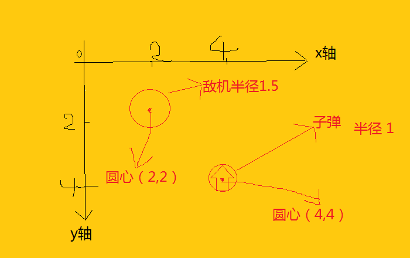

###1. 2d游戏的碰撞检测算法
> 飞机射击类游戏经常用到。原理简单来说就是圆的相切，相离，相交。
  
```
   相交，相切说明中弹了，相离说明毫发无伤，设敌机圆心p1=(2,2)，半径r1 = 1.5,子弹圆心p2 = 
   (4,4)，半径r2 = 1，两者之间的距离为L.
   中弹：L <= r1 + r2 = \sqrt{(p2.x - p1.x)^2 + (p2.y - p1.y)^2}
   没事：L>r1 + r2.
```
其他的我方战机中弹，撞机同理。