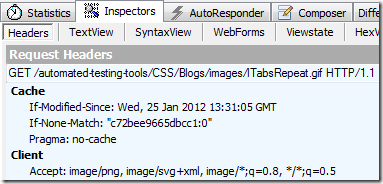
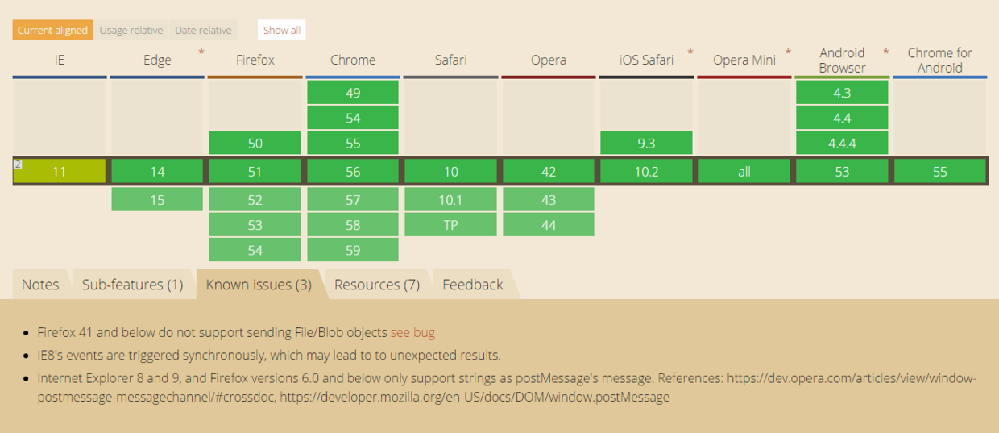
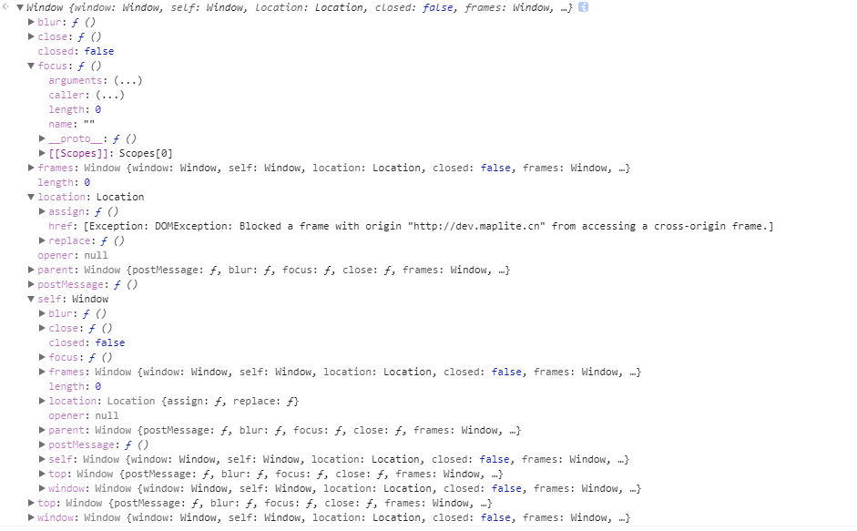

### 1.http状态码详解  
> 304：这个请求跟缓存有关，当客户端缓存了服务器的资源，但是它又不知道是不是最新时，他就会发一个请求给
服务器，请求头带有`If-Modified-Since`,其值是服务器上次放回的`Last-Modified`响应的日期值，还会提供一个`If-None-Match`
的请求头，其值为服务器上次放回的`ETag`响应值。  
  

服务器接到这个请求，并读取这两个值，如果服务器资源跟客户端请求资源一致，即没有发生改变，则服务器放回
304，`http/304 Not Modified`，客户端继续读缓存资源。如果客户端缓存资源过期，则服务器放回`http/200`，响应体是
最新内容。<strong>只有客户端缓存了资源并且请求头包含上述两个参数时，才能发送改请求，否则表示无条件请求该资源
，服务器也无条件放回完整最新资源。</strong>   
### 2.domain设置规则：  
```
域名A: http://a.xxx.com  域名B: http://c.xxx.com
```
为了a b两个页面的可以相互通信，必须设置domian相同。有两个注意点：  
1. 只能往小设置，比如域名a可以设置为`xxx.com`,不能设置为`a.yyy.com`,即只能是域名a包含的域名。
2. 松散的域名设置为紧绷后，不能往回设置了。`xxx.com`设置完成后不能设置为`a.xxx.com`。

### 3.输出一个页面所有用到的标签  
```
var arr =[];
function a(obj){

	if(arr.indexOf(obj.nodeName) == -1)arr.push(obj.nodeName);
	if(obj.children){
    	for(var i=0;i<obj.children.length;i++){
        	a(obj.children[i]);
		}
	}
}
a(document);
```
```
var b = ['#document'];//doucment先push
var list = document.getElementsByTagName('*');
Array.prototype.forEach.call(list,function(item){
	if(b.indexOf(item.nodeName) == -1)b.push(item.nodeName)
})

ie8以下没有element.children这个属性，下面是兼容children写法,
// Overwrites native 'children' prototype.
// Adds Document & DocumentFragment support for IE9 & Safari.
// Returns array instead of HTMLCollection.
(function(constructor) {
    if (constructor &&
        constructor.prototype &&
        constructor.prototype.children == null) {
        Object.defineProperty(constructor.prototype, 'children', {
            get: function() {
                var i = 0, node, nodes = this.childNodes, children = [];
                while (node = nodes[i++]) {
                    if (node.nodeType === 1) {
                        children.push(node);
                    }
                }
                return children;
            }
        });
    }
})(window.Node || window.Element);

```  

### 4.跨域解决方案：  
1. 设置domain，详见第2点。<strong>特别注意，这个跨域成立的前提是
主域相同</srtong>  
2. 完全不同源的跨域，即两个不同页面之间的通信。  
2.1 通过window.name跨域：  
`window.name`有个特性，就是在一个窗口的生命周期内（关闭之前），这个窗口内所有载入的页面都是共享一个
`window.name`的，即使这个窗口加载不同源的页面，他们也是共享`window.name`。所以不同页面之间可以这样
通信：
    ```
    //a.html
    //首先父b自己建一个iframe，这个iframe的src指向不同的页面b
    let iframe = document.createElement('iframe'); 
    iframe .src = b;
    
    .......
    //b.html要做的事，将数据写到window.name
    window.name = data;
    
    .......
    //a.html接着要做的事，将ifram.src改回自己主域下的路径,取出数据
    iframe.src = a//xxx.html;
    let data = document.getElementById('myFrame').contentWindow.name;
    ```
    2.2 window.hash跨域：  
    原理：父窗口可以修改自己下面的iframe的URL，iframe也可以修改父的URL,URL有一部分叫做hash值。就是一个
    URL带#后面的值。修改它不会产生http请求，但是会产生浏览器记录。  
  
    假如父`baidu.com/a.html` ,iframe里面是`google.com/b.html`。  
    >a跟b通信  
      
    - a修改iframe的src为`google.com/b.html#lalaxiaojie`.  
    - b监听到url发生变化，获取数据.  
    >b跟a通信，由于两个页面不在同一个域下IE、Chrome不允许修改parent.location.hash的值，
    所以要借助于父窗口域名下的一个代理iframe。  
    
    -  b自己建一个iframe,iframe的src是`baidu.com/proxy.html`,并写上数据`baidu.com/proxy.html#
    pipigege`.  
    - proxy.html监听自己的url发生变化，修改a.html的url`baidu.com/a.html#pipigege` , a跟proxy是同域的.  
    - a监听自己的url，获取数据.  

    2.3 通过window.postMessage跨域,这个是html5的全新api，不做详解，要用去搜api。
    

3. JSONP。script不受同源策略限制，同时跨域请求到的脚本不仅包含数据，还可以有一个回调。  
```
    //http://baidu.com/a是要请求的脚本
    let data = {
        lala: 'hellow'
    };
    callback(data);
    
    ..................................
    //http://google.com/b获取a的数据
    let callback = function(){
       ...
    }
    let script = document.createElement('script');
    script.src = 'http//baidu.com/a';
    document.body.append(script);
```
jquery的ajax有jsonp这个调用方式，在参数dataType中设置jsonp,jsonpCallback设置你的回调。  

4. 跨域资源共享CORS（html5）。服务器设置`Access-Control-Allow-OriginHTTP`
响应头之后，浏览器将会允许跨域请求。

```
//服务器设置
access-control-allow-origin: https://baidu.com //允许百度来访问我
access-control-allow-origin: * //任何人都可以
```
5. 此外还有长连接like comet和websocket这些方案。

### 5.跨域后可以访问的window方法.
