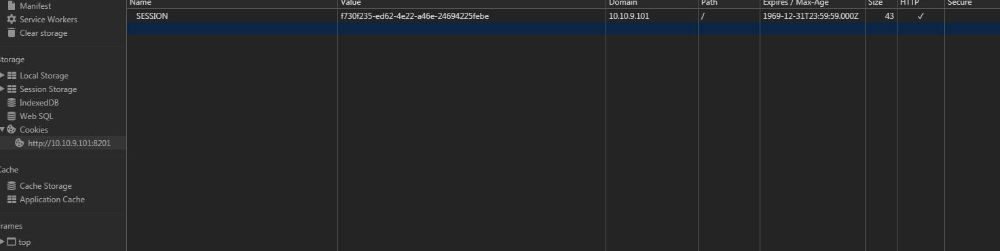

### 1.http状态码详解  
> 304：这个请求跟缓存有关，当客户端缓存了服务器的资源，但是它又不知道是不是最新时，他就会发一个请求给
服务器，请求头带有`If-Modified-Since`,其值是服务器上次放回的`Last-Modified`响应的日期值，还会提供一个`If-None-Match`
的请求头，其值为服务器上次放回的`ETag`响应值。  
  

服务器接到这个请求，并读取这两个值，如果服务器资源跟客户端请求资源一致，即没有发生改变，则服务器放回
304，`http/304 Not Modified`，客户端继续读缓存资源。如果客户端缓存资源过期，则服务器放回`http/200`，响应体是
最新内容。<strong>只有客户端缓存了资源并且请求头包含上述两个参数时，才能发送改请求，否则表示无条件请求该资源
，服务器也无条件放回完整最新资源。</strong>   
### 2.domain设置规则：  
```
域名A: http://a.xxx.com  域名B: http://c.xxx.com
```
为了a b两个页面的可以相互通信，必须设置domian相同。有两个注意点：  
1. 只能往小设置，比如域名a可以设置为`xxx.com`,不能设置为`a.yyy.com`,即只能是域名a包含的域名。
2. 松散的域名设置为紧绷后，不能往回设置了。`xxx.com`设置完成后不能设置为`a.xxx.com`。

### 3.输出一个页面所有用到的标签  
```
var arr =[];
function a(obj){

	if(arr.indexOf(obj.nodeName) == -1)arr.push(obj.nodeName);
	if(obj.children){
    	for(var i=0;i<obj.children.length;i++){
        	a(obj.children[i]);
		}
	}
}
a(document);
```
```
var b = ['#document'];//doucment先push
var list = document.getElementsByTagName('*');
Array.prototype.forEach.call(list,function(item){
	if(b.indexOf(item.nodeName) == -1)b.push(item.nodeName)
})

ie8以下没有element.children这个属性，下面是兼容children写法,
// Overwrites native 'children' prototype.
// Adds Document & DocumentFragment support for IE9 & Safari.
// Returns array instead of HTMLCollection.
(function(constructor) {
    if (constructor &&
        constructor.prototype &&
        constructor.prototype.children == null) {
        Object.defineProperty(constructor.prototype, 'children', {
            get: function() {
                var i = 0, node, nodes = this.childNodes, children = [];
                while (node = nodes[i++]) {
                    if (node.nodeType === 1) {
                        children.push(node);
                    }
                }
                return children;
            }
        });
    }
})(window.Node || window.Element);

```  

### 4.跨域解决方案：  
1. 设置domain，详见第2点。<strong>特别注意，这个跨域成立的前提是
主域相同</srtong>  
2. 完全不同源的跨域，即两个不同页面之间的通信。  
2.1 通过window.name跨域：  
`window.name`有个特性，就是在一个窗口的生命周期内（关闭之前），这个窗口内所有载入的页面都是共享一个
`window.name`的，即使这个窗口加载不同源的页面，他们也是共享`window.name`。所以不同页面之间可以这样
通信：
    ```
    //a.html
    //首先父b自己建一个iframe，这个iframe的src指向不同的页面b
    let iframe = document.createElement('iframe'); 
    iframe .src = b;
    
    .......
    //b.html要做的事，将数据写到window.name
    window.name = data;
    
    .......
    //a.html接着要做的事，将ifram.src改回自己主域下的路径,取出数据
    iframe.src = a//xxx.html;
    let data = document.getElementById('myFrame').contentWindow.name;
    ```
    2.2 window.hash跨域：  
    原理：父窗口可以修改自己下面的iframe的URL，iframe也可以修改父的URL,URL有一部分叫做hash值。就是一个
    URL带#后面的值。修改它不会产生http请求，但是会产生浏览器记录。  
  
    假如父`baidu.com/a.html` ,iframe里面是`google.com/b.html`。  
    >a跟b通信  
      
    - a修改iframe的src为`google.com/b.html#lalaxiaojie`.  
    - b监听到url发生变化，获取数据.  
    >b跟a通信，由于两个页面不在同一个域下IE、Chrome不允许修改parent.location.hash的值，
    所以要借助于父窗口域名下的一个代理iframe。  
    
    -  b自己建一个iframe,iframe的src是`baidu.com/proxy.html`,并写上数据`baidu.com/proxy.html#
    pipigege`.  
    - proxy.html监听自己的url发生变化，修改a.html的url`baidu.com/a.html#pipigege` , a跟proxy是同域的.  
    - a监听自己的url，获取数据.  

    2.3 通过window.postMessage跨域,这个是html5的全新api，不做详解，要用去搜api。
    

3. JSONP。script不受同源策略限制，同时跨域请求到的脚本不仅包含数据，还可以有一个回调。  
```
    //http://baidu.com/a是要请求的脚本
    let data = {
        lala: 'hellow'
    };
    callback(data);
    
    ..................................
    //http://google.com/b获取a的数据
    let callback = function(){
       ...
    }
    let script = document.createElement('script');
    script.src = 'http//baidu.com/a';
    document.body.append(script);
```
jquery的ajax有jsonp这个调用方式，在参数dataType中设置jsonp,jsonpCallback设置你的回调。  

4. 跨域资源共享CORS（html5）。服务器设置`Access-Control-Allow-OriginHTTP`
响应头之后，浏览器将会允许跨域请求。

```
//服务器设置
access-control-allow-origin: https://baidu.com //允许百度来访问我
access-control-allow-origin: * //任何人都可以
```
5. 此外还有长连接like comet和websocket这些方案。

### 5.跨域后可以访问的window方法.


### 6.网站安全
1. xss攻击：跨站脚本攻击  
1.1 原理：web没有对用户提交的请求进行充分的检查和过滤，导致一些恶意攻击者
可以在提交的数据中加入HTML代码（像< ,>)，并且将未转义的字符输出的第三方用户浏览器中
运行。
1.2 举个简单例子：比如在一个评论社区网站，没有预防xss攻击，这时候有个恶意用户a提交了一条评论
    ```
    <script>
    let cookie = document.cookie;//好了，他已经够拿到某个用户页面的cookie
    send(cookie)//发到网站hack
    </script>
    
    ```
    这个时候用户b登录了系统，查看了这个页面的评论。那么这个用户的cookie在不知觉的
    情况下就被人拿了。  
    1.3 预防措施：  
    + 过滤特殊的字符串
    + 使用http头指定类型
    ```
    w.Header().Set("Content-Type","text/javascript")
            
    这样就可以让浏览器解析javascript代码，而不会是html输出。
     ```  
     参考链接：https://github.com/astaxie/build-web-application-with-golang/blob/master/zh/09.3.md
     https://blog.csdn.net/u011781521/article/details/53894399
     
2. CSRF:跨站请求伪造  
2.1 原理：用户登录某个信任站点a，生成了cookie，接着没有关闭，登出的情况下点了某个站点b
的链接，b站点范围了站点a,发了一个请求。  
2.2 举例：用户登录银行网站a,成功后生成cookie，这时用户访问b网站，然后点了一个
链接，`　`
`toBankId`是攻击者账号，这样就不自觉间就被转账了。（cookie是会默认携带在同一域名下的）。  
2.3 预防：服务器使用post请求，请求表单增加伪随机数；使用验证码。
### 7.网站加密
1.md5加密：使用一个哈希算法加密原本的明文，得到加密后的明文。
+ md5不能算是加密算法，因为它是单向的、不可逆的，你没法对经过md5运算过的密码进行“解密”而得到原始的明文密码，
但确实在md5与密码发生关系时我们喜欢叫它“加密”。所以就算攻击者知道你用了
md5哈希算法，截获了你“加密”后的密码，即md5(password)（不妨设md5哈希函数为md5()，
用户明文密码为password），也无法通过倒推得知用户的明文密码，只能暴力穷举猜测用户的密码。                              
其次，就算攻击者不知道password，只知道md5(password)，也足够了，
他只要向服务器发送md5(password)便能通过认证。而且验证的过程仍为明文对比，
只是从对比明文密码变成对比明文密码的哈希值。为了解决这个问题，有人提出给密码“加盐”：
服务器既不存储明文密码password，也不存储md5(password)，而是存储
md5(password)和salt，这个salt即“盐”。用户每次登陆时，服务器先生成一个
动态的、短时间内不会重复的salt发送给用户，然后用户将md5(md5(password) + salt)
发回给服务器，服务器经过同样的运算后对比结果，一致则通过验证。这样一来，
攻击者就算截获了salt和md5(md5(password) + salt)，也无法倒推出md5(password)，
同时salt一经使用，就会失效，攻击者就无法通过重新发送
md5(md5(password) + salt)来伪装成用户。
但上述做法有个问题（至少一个问题）：设置密码时，用户必须告知服务器
md5(password)，同时服务器上会明文存储md5(password)，如果设置密码时
md5(password)被截获，或服务器的数据库被入侵，攻击者就会得知md5(password)，
从而就可以伪装成用户通过密码验证了。而且，如果这个用户在其它网站也使用了
一样的密码（这是很常见的），其它网站又刚好使用了一样的密码验证方式，
攻击者就能同时获得该用户在多个网站的授权（撞库）。
这个问题的根本原因是设计者没有摆脱“明文密码”，
用md5(password)来代替明文密码与直接使用明文密码没有太大区别，因此有人提出，
我们不要用md5(password)，改用md5(password + salt)吧。这里的salt不是
前面的salt，前面的是“动态盐”，现在所说的是“静态盐”，为了区分，用dsalt代
表动态盐，用ssalt代表静态盐。那么登陆方式就变成：服务器存储
md5(password + ssalt)和与之配套的静态盐ssalt（静态盐在设置密码时配套生成），
登陆时，服务器动态生成随机的动态盐dsalt，将ssalt和dsalt一同发给用户，
用户将md5(md5(password + ssalt) + dsalt)发回给服务器，
服务器进行同样的运算，结果一致则验证通过。这样一来，就算攻击者知道了
md5(password + ssalt)，也只是攻破了这个用户在一个网站上的账户，而不能
攻破该用户使用的其它网站的账户——因为攻击者不能通过md5(password + ssalt)
倒推出md5(password)，且对于其它网站，静态盐ssalt也是不同的.

2.对称加密
>双方加密和解密使用相同的密钥。这个密钥用于通信双方队明文进行加密和解密，原理就是
mod运算。

3.非对称加密
>对称加密中就有公钥和私钥之分。公钥是可以公开的，即所有人都可以知道，但是私钥是你自己
保留的，用于解密使用。客户端A跟服务器端B通信，A用公钥加密后的数据只有知道私钥的
服务器B才能解开，B发送给A的数据呢，所有人都可以用公钥解开。
+ 简单的这种非对称加密会遭遇中间人攻击，可以用数字证书预防。https://blog.ymfe.org/Man-In-The-Middle-Attack/

+ <strong>现在的通信都是先用非对称加密进行通信，交换用于对称加密生成密钥的因子
，然后用双方生成的这个因子生成对称加密的密钥，接着用这个密钥进行安全通信。</strong>

### 8.网站优化问题
> 先来普及下知识，浏览器跟服务器通信发请求的时候是有连接数限制的，看个表。

| ersion                          | HTTP 1.0 server (broadband connection) | HTTP 1.1 server (broadband connection) | HTTP 1.0 server (dial-up connection) | HTTP 1.1 server (dial-up connection) |
| :------------------------------ | :------------------------------------- | :------------------------------------- | :----------------------------------- | :----------------------------------- |
| Internet Explorer 7 and earlier | 4                                      | 2                                      | 4                                    | 2                                    |
| Internet Explorer 8             | 6                                      | 6                                      | 4                                    | 2                                    |

在谷歌下，最大连接数是6.当然IE的限制可以在注册表中修改，
HKEY_LOCAL_MACHINE\SOFTWARE\   Microsoft\Internet Explorer\MAIN\FeatureControl\FEATURE_MAXCONNECTIONSPERSERVER。
谷歌下，超过连接数就会被阻塞，排队，

因为前面有迭代请求的关系，连接数超过6个，而且响应又慢，导致一个静态的html文件被阻塞了
5秒多。

1. 所以对js,css这些静态资源进行压缩合并，可以减少请求数。
减少请求数量 也就是降低瀑布图的高度. 瀑布图越矮越好.
2. 图片雪碧图。
3. 请求接口优化，对于相同接口同时多次请求数据的，合并成一个批量接口，一起放回
初始化数据。

### 9. [cookie详解](https://segmentfault.com/a/1190000004556040)
### 10.javascript内存牵扯的东西
> js就两种值，引用或基本类型值。基本的数据类型五种：`undefined，null,
boolen,Number,String`，这五种是值来访问操作的，即可以直接操作内存中的那个值。

>函数传递是按值来传递的，参数是对象的时候即使是按值传递，它也是按引用来的。
````angular2html
var num = 20;
function add(count){
    count += 10;
    return count;
}
var result = add(num);
console.log(num);//20
console.log(result);//30

//----------------对于对象----------------------
function setName(obj){
    obj.name = 'Eason';
}
var person = new Object();
setName(person);
console.log(person.name);//eason

//****************************************
        说明对象参数按引用传递了
//*******************************

//列子2
function setName(obj){
    obj.name = 'Eason';
    obj = new Object();
    obj.name = ’chenlaoshi';
}
var person = new Object();
setName(person);
console.log(person.name);//eason

why?!!!!!!!!!!!!!!!!!
````
我们解释下例子2为什么是这样，看图

其实上述代码就是下面这样
```
function setName(){
    var obj = person;
    obj.name = 'Eason';
    obj = new Object();
    obj.name = ’chenlaoshi';
}
var person = new Object();
setName(person);
console.log(person.name);//eason
```
> 执行环境跟作用域链。执行环境定义了变量和函数有权访问的数据，其实就是作用域每
个环境都有一个与之关联的变量对象，这个环境中所有定义的变量和函数都保存在
这变量对象中。当代码在一个环境中运行的时候，就会创建变量对象的一个作用域链。

> AO：Activetion Object（活动对象）
VO：Variable Object（变量对象）
VO对应的是函数创建阶段，JS解析引擎进行预解析时，
所有的变量和函数的声明，统称为Variable Object。该变量与执行上下文相关，
知道自己的数据存储在哪里，并且知道如何访问。VO是一个与执行上下文相关的特殊对象，
它存储着在上下文中声明的以下内容：
+ 变量 (var, 变量声明);
+ 函数声明 (FunctionDeclaration, 缩写为FD);
+ 函数的形参
```
function a(x,y){
    var b=x+y;
    function say(){
      console.log(b);
    }

}
//b, say, x, y组合的对象是vo,不过该对象基本都是undefined
```
AO对应的是函数执行阶段，当函数被调用执行时，会建立一个执行上下文，
该执行上下文包含了函数所需的所有变量，该变量共同组成了一个新的对象就是
Activetion Object。该对象包含了：
+ 函数的所有局部变量
+ 函数的所有命名参数
+ 函数的参数集合
+ 函数的this指向
```angular2html

a(4,5);
//  我用JS对象来表示AO
//  AO = {
//	    this : window,
//	    arguments : [4,5],
//	    x : 4,
//	    y : 5,
//	    say : ,
//	    b : undefined
//  }
```
当代码在一个环境中执行时，会创建变量对象的一个作用域链（scope chain）
来保证对执行环境有权访问的变量和函数的有序访问。作用域第一个对象始终是当前执行
代码所在环境的变量对象（VO）
```
function a(x,y){
	var sum = x + y;
	return sum;
}
```
假设函数是在全局作用域中创建的，在函数a创建的时候，它的作用域链填入全局对象,
全局对象中有所有全局变量，此时的全局变量就是VO。此时的作用域链就是：
```angular2html
此时作用域链（Scope Chain）只有一级,就为Global Object

	scope(add) -> Global Object(VO)
	
	VO = {
		this : window,
		add : 
	}
```

如果是函数执行阶段，那么将其activation object（AO）作为作用域链第一个对象
，第二个对象是上级函数的执行上下文AO，下一个对象依次类推。
```angular2html
 var tatal=a(5,10);
```


> 内存回收
+ 标记清除（mark and sweep）:当变量进入执行环境的时候(调用)，比如函数中声明一个变量，
垃圾回收器将其标记为“进入环境”，当变量离开环境的时候（函数执行结束）将其标记为
“离开环境”。这时候就会回收变量所占用内存。
+ 引用计数：引用计数的策略是跟踪记录每个值被使用的次数，当声明了一个变量并将一
个引用类型赋值给该变量的时候这个值的引用次数就加1，如果该变量的值变成了另外一个
，则这个值得引用次数减1，当这个值的引用次数变为0的时候，说明没有变量在使用，这
个值没法被访问了，因此可以将其占用的空间回收。

> 闭包带来的问题：造成变量不能被回收。ie9下只要涉及
com的都是使用引用计数的方式，闭包就会导致引用计数一直存在。
现在我感觉基本都不用担心这个东西了。

### 11.[XMLHttpRequest](https://segmentfault.com/a/1190000004322487)
### 12. cookie和session
> 产生原因：http协议是无状态的，所以服务器是无法知道下次跟他交互的是谁，
就无法保持客户端和服务区端的通话。cookie和session为此产生。
+ cookie:大渣都叫他甜甜圈。是服务器保存在客户端的加密后的数据，一般是加密后的用户名，
用户id这些信息。
+ session:存在服务器端，也是用来保存用户身份信息的，但他是一个session id
，这个session id是不重复，无规律的。服务器产生session发给客户端，客户端 
保存session id的方式可以采用cookie，这样在交互过程中浏览器可以自动的按照规则
把这个标识发挥给服务器。一般这个cookie的名字都是类似于SEEESIONID。
但cookie可以被人为的禁止，则必须有其他机制以便在cookie被禁止时仍然
能够把session id传递回服务器。 经常被使用的一种技术叫做URL重写，就是把
session id直接附加在URL路径的后面。还有一种技术叫做表单隐藏字段。就是服务器会
自动修改表单，添加一个隐藏字段，以便在表单提交时能够把session id传递回服务器。


区别：
- 存放位置不同，甜甜圈是客户端的，session是服务器端的。
- 有效期，甜甜圈可以很久，session关闭浏览器就没了。为什么？因为cookie有两种
一种是会话cookie，一种是硬盘的，前者关闭浏览器就没了。会话cookie和持久cookie
之间唯一的区别就是他们的过期时间。如果设置了Discard参数(true,客户端不能保存)，
或者没有设置Expires或Max-Age参数来说明扩展的过期时间，这个cookie就是
一个会话cookie。
- cookie可以跨域。

### 13.[web缓存](https://segmentfault.com/a/1190000006741200)
### 14.[不同浏览器flash与其他元素发生覆盖汇总及解决](http://www.w3help.org/zh-cn/causes/RX8012)

### 15. [JavaScript设计模式](https://juejin.im/entry/58c280b1da2f600d8725b887)

### 16. 闭包的优缺点
```
    function a(){
        var b = 1,c;
        function d(){
            c = b + 1;
            console.log(c);
        }
    }
```
能够访问函数内部变量的函数叫做闭包。
+ 闭包可以避免变量的污染，因为变量只在其作用域内才有效。
+ 闭包会使变量无法释放，因为存在某个函数引用它，所以该变量是常驻内存的，
利用这一点我们可以优化加载问题，将计算难的结果保存在内存中。
+ 闭包滥用在ie下回导致内存泄露，因为变量得不到释放，所以当函数执行完毕后，释放到
一些不用的中间变量
```
function a(){
        var b = 1,c;
        function d(){
            c = b + 1;
            console.log(c);
            c = null;//释放c,或者将c写在d作用域中
        }
    }
```
### 17.[深度拷贝和浅拷贝](https://github.com/wengjq/Blog/issues/3)
http://www.imooc.com/article/19828
http://www.cnblogs.com/imwtr/p/4666181.html
```
    // 递归实现一个深拷贝,暂时还没写属性是函数的东西
    function deepClone(source){
       if(!source || typeof source !== 'object'){
         throw new Error('error arguments', 'shallowClone');
       }
       var targetObj = source.constructor === Array ? [] : {};
       for(var keys in source){
          if(source.hasOwnProperty(keys)){
             if(source[keys] && typeof source[keys] === 'object'){
               targetObj[keys] = source[keys].constructor === Array ? [] : {};
               targetObj[keys] = deepClone(source[keys]);
             }else{
               targetObj[keys] = source[keys];
             }
          } 
       }
       r
```
### 18. jquery自定义插件方法`$.fn.myplungin`是扩展在jquery的原型链上的.即所有jQuery对象都拥有了myPlugin方法.

### 19 amd,cmd,umd,commonjs
+ amd: 异步加载模块，并且是依赖前置执行，所有的依赖下载完在执行完毕在执行callback
+ cmd: 通用模块定义,依赖就近，所以在define函数中不些依赖，只有使用的时候才去require
```
define(function(require,exports,module) { 
    var add = require('math').add; 
    exports.increment = function(val) { 
        return add(val,1); 
    }; 
});
```

+ commonjs:主要用于服务器规范,nodejs，每个文件都是单独的模块。每个模块就是
一个单独的作用域，在某个文件定义的变量都是私有的。
+ umd:umd是AMD和CommonJS的糅合

<strong>AMD和CMD最大的区别是对依赖模块的执行时机处理不同,注意不是加载的时机或者方式不同
        加载模块都是异步的,只不过AMD依赖前置,js可以方便知道依赖模块是谁
        ,立即加载,而CMD就近依赖,需要使用把模块变为字符串解析一遍才知道依
        赖了那些模块,这也是很多人诟病CMD的一点,牺牲性能来带来开发的便利性,
        实际上解析模块用的时间短到可以忽略
        同样都是异步加载模块,AMD在加载模块完成后就会执行该模块,所
        有模块都加载执行完后会进入require的回调函数,执行主逻辑,这
        样的效果就是依赖模块的执行顺序和书写顺序不一定一致,看网络速
        度,哪个先下载下来,哪个先执行,但是主逻辑一定在所有依赖加载完成后才执行
        
        CMD加载完某个依赖模块后并不执行,只是下载而已,在所有依赖模块加载完成后进入主逻辑,遇到require语句的时候才执行对应的模块,这样模块的执行顺序和书写顺序是完全一致的
        
</strong>

### 20. vue多次更改值只渲染一次的原理。
https://juejin.im/post/5a45fdeb6fb9a044ff31c9a8

```

//mouted下
    this.inputName = 1;
    setTimeout(() => {
      this.inputName = 2;
    }, 0);
    
    this.inputName = 1;
    new Promise((resolove)=>{
      resolove();
    }).then(() => {
      this.inputName = 2;
    })
  
```
第一段代码会触发两次dom更新，第二端会触发一次，这里涉及到宏任务跟微任务这两个概念，宏任务与微任务产生的方式并不相同，浏览器环境下setImmediate，MessageChannel，setTimeout会产生宏任务，而MutationObserver ，Promise则会产生微任务。
>宏任务微任务：

https://jakearchibald.com/2015/tasks-microtasks-queues-and-schedules/?utm_source=html5weekly

https://segmentfault.com/a/1190000016022069

https://github.com/aooy/blog/issues/5
> 微任务产生微任务是会一直执行的，不会等到下次event loop

微任务的优先级是比宏任务高的，所以它会先执行。vue中dom的更新是异步的，

第一段代码中，setTimeout产生宏任务，会在第二次事件循环中，promise产生微任务，会在本次事件循环中，在调用栈空了之后会执行所有的微任务，微任务执行完毕就会渲染dom，渲染完成在进行下轮事件循环。而vue的dom更新是用微任务还是宏任务是它决定的，用了v-on-click的时候，里面的回调就是用宏任务，在mouted这里则用微任务，那么这里setTimout用宏任务，而vue更新dom用微任务，那么就会出现两次dom渲染。在promise中，都是微任务，而vue更新dom也用微任务，这两个就会只在一次event loop中执行完毕，更新一次dom。
> vue更新dom的操作，像多次赋值这种，它内部的queue只会压入一个watcher，用id来区分。那他怎么知道最后一次更新的值呢，原理是他会在nexttick回调，执行wacther.run()，再去那vm保存的最后一个值，用来更新dom。
```
/**
 * 将watcher实例推入queue(一个数组)中，
 * 被has对象标记的watcher不会重复被加入到队列
 */
export function queueWatcher (watcher: Watcher) {
  const id = watcher.id
  // 判断watcher是否被标记过，has为一个对象，此方案类似数组去重时利用object保存数组值
  if (has[id] == null) {
    // 没被标记过的watcher进入分支后被标记上
    has[id] = true
    if (!flushing) {
      // 推入到队列中
      queue.push(watcher)
    } else {
      // 如果是在flush队列时被加入，则根据其watcher的id将其插入正确的位置
      // 如果不幸该watcher已经错过了被调用的时机则会被立即调用
      // 稍后看flushSchedulerQueue这个函数会理解这两段注释的意思
      let i = queue.length - 1
      while (i > index && queue[i].id > watcher.id) {
        i--
      }
      queue.splice(i + 1, 0, watcher)
    }
    // queue the flush
    if (!waiting) {
      waiting = true
     // 我们关心的重点nextTick函数，其实我们写的this.$nextTick也是调用的此函数
      nextTick(flushSchedulerQueue)
    }
  }
}
```

### 21. ios重绘bug
+ 现象：移动端h5卡片堆叠移动，移动之后发现样式已经覆盖上去，可是无法滚动，这时候点击vconsole，发现可以滚动了。
+ 问题： 点击vconsole的时候，body增加了dom节点，发生了重排和跟重绘，这时候将卡片的样式也重绘了一次，正常。
+ 解决：这时候只能强制浏览器去重排跟重绘，改变display去强制重绘，问题解决，网上说的ios无法滚动，可以改变子元素的高度这些来解决，本质原理也是重绘。